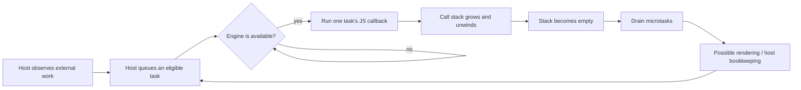

# Asynchrony: Now & Later

> Technical study notes for *You Don't Know JS: Async & Performance*, Chapter 1.
> The chapter's ES6-era terminology is retained where useful, with modern
> browser, ECMAScript, V8, and Node.js distinctions called out explicitly.

## 1. A Program in Chunks: "Now" and "Later"

Asynchrony is fundamentally about **a program whose execution is split across
time**. Some work runs in the current execution turn ("now"); other work cannot
run until an external condition is satisfied and a future execution opportunity
is granted ("later"). The time between those chunks is not JavaScript code
quietly waiting on the call stack. The current chunk finishes, its stack is
discarded, and a host environment may invoke another chunk later.

Typical boundaries between now and later include:

- a timer reaching its threshold;
- a network, file-system, or database operation completing;
- a user-input event becoming ready for dispatch;
- a rendered frame or animation callback becoming eligible;
- a Promise reaction being scheduled after settlement.

The most common unit of asynchronous chunking is a function used as a callback.
It packages the code and its lexical references so the host or runtime can call
it after the initiating code has returned.

```js
function now() {
  return 21;
}

function later() {
  answer *= 2;
  console.log("Meaning of life:", answer);
}

let answer = now();         // current synchronous chunk
setTimeout(later, 1_000);   // registers future work, then returns
```

The two execution chunks are:

```text
Current turn (now)                  Future turn (later)
--------------------------------   -----------------------------
define now() and later()           enter later()
call now()                          read and update answer
assign answer = 21                  call console.log(...)
register a one-second timer         return; future stack is empty
finish the current script
```

`setTimeout()` does **not** pause the function, create a sleeping JavaScript
stack, or guarantee execution at an exact wall-clock instant. It asks the host
to track a timer. Once the delay threshold has elapsed, the callback becomes
eligible to be scheduled; it still must wait until JavaScript can run it.

### Non-blocking I/O and continuation code

An asynchronous API cannot return a result that does not exist yet:

```js
const data = ajax("/api/report");
console.log(data); // not the eventual response
```

The call starts an operation and returns before the remote result arrives. Code
that depends on that result must be moved into a later continuation:

```js
ajax("/api/report", function onReport(data) {
  console.log(data);
});
```

Modern APIs frequently represent the same relationship with a Promise and
`await`, but the temporal split still exists. `await` does not turn network I/O
into blocking I/O; it suspends that async function and schedules its continuation
after the awaited Promise settles.

```js
async function showReport() {
  const response = await fetch("/api/report");
  const data = await response.json();
  console.log(data);
}
```

This leads to the chapter's central design problem: state must remain coherent
across a gap during which other work may run. Shared variables, DOM state,
request ordering, cancellation, and errors can all change between initiation
and continuation.

### Language, engine, and host are different layers

"JavaScript does X" often compresses three distinct responsibilities:

| Layer | Browser example | Node.js example | Responsibility |
| --- | --- | --- | --- |
| ECMAScript language | functions, execution contexts, Promises | same | Defines syntax, values, execution semantics, and abstract Jobs/host hooks. |
| JavaScript engine | V8 in Chromium | V8 in Node.js | Parses, compiles, optimizes, and executes ECMAScript; manages stacks, heaps, and Promise microtasks with embedder integration. |
| Host/embedder | Chromium/Blink and Web Platform APIs | Node.js and libuv | Supplies timers, networking, DOM or file-system APIs, event-loop policy, and opportunities to enter the engine. |

V8 alone is not "the browser" and does not provide the DOM, `fetch()`, or the
web event loop. Chromium embeds V8 and connects it to Web Platform facilities.
Node.js also embeds V8, but exposes a different global API surface and uses a
different event-loop implementation and scheduling policy. The ECMAScript
specification deliberately leaves host integration points for these environments.

### Async console caveats

`console.*` is a host-provided debugging interface, not an ECMAScript language
primitive. Its display behavior therefore must not be treated as a precise
record of engine-level execution or object state.

```js
const record = { index: 1 };

console.log(record);
record.index++;
```

Developer tools may retain a reference to `record` and render or expand it only
when the user inspects the entry. The console can then display `{ index: 2 }`
even though `index` was `1` when `console.log()` was called. This is chiefly a
debugger/host presentation issue, not evidence that the assignment executed
before the log statement.

For a stable observation:

```js
console.log(structuredClone(record)); // snapshot clone, where supported
console.log(JSON.stringify(record));  // serialized snapshot, with JSON limits
```

For ordering bugs, debugger breakpoints and watch expressions are generally
stronger evidence than console rendering. Also remember that `console.log()`
itself can perform I/O and may perturb timing, especially in hot paths.

### Topic 1 invariants

1. Asynchronous work is organized as separate execution chunks, not as one
   continuously blocked JavaScript call stack.
2. A timer delay is an eligibility threshold, not a deadline or exact schedule.
3. A callback or async-function continuation carries the computation across the
   gap, while program state may change during that gap.
4. Browser/Node APIs and event-loop policies belong to the host; language
   semantics and abstract Promise Jobs belong to ECMAScript; V8 is one concrete
   engine used by multiple hosts.
5. Console output is diagnostic host behavior and may show live objects rather
   than immutable snapshots.

## 2. Engine Runtime Model: Event Loop and Concurrency

### Call stack and execution contexts

When an engine invokes JavaScript, it tracks active execution contexts on a
**call stack**. A function call pushes a context; returning removes it. Only the
top context is currently executing JavaScript in an agent.

```js
function third() {
  return 42;
}

function second() {
  return third();
}

function first() {
  return second();
}

first();
```

```text
push script     [script]
push first      [script, first]
push second     [script, first, second]
push third      [script, first, second, third]
return third    [script, first, second]
return second   [script, first]
return first    [script]
finish script   []
```

The stack is an engine execution structure, not the event loop. The event loop
decides *when* a host-scheduled unit of work may enter the engine. Once entered,
ordinary JavaScript calls create and remove stack frames synchronously until
that unit of work finishes.

### Host scheduling and the event loop

The chapter uses a single FIFO `eventLoop` array as teaching pseudocode. That is
a useful first model, but modern browser event loops are more nuanced: an event
loop owns one or more **task queues**, the browser chooses a runnable task under
the HTML scheduling rules, runs it, performs a microtask checkpoint, and may
then render. A task queue is associated with a task source so a browser can
preserve required source ordering while still prioritize among sources.

At a conceptual level:



The host may perform network polling, timer tracking, rendering, or file-system
work outside the JavaScript call stack and, depending on the implementation,
on other native threads. This does not imply that callbacks for those operations
execute simultaneously on the same JavaScript agent. The host schedules an
entry into the engine when the operation's continuation is ready.

#### Why `setTimeout(fn, 0)` is not immediate

```js
setTimeout(() => console.log("timer"), 0);
busyLoopFor(200);
console.log("script complete");
```

The timer registers with the host. Even after its minimum delay has elapsed, its
callback cannot interrupt `busyLoopFor()`. It becomes a candidate for a later
task and prints only after the current script completes (and after applicable
microtasks). Real hosts may also clamp nested or background timers.

### Run-to-completion

For ordinary tasks and Jobs within one ECMAScript agent, JavaScript has
**run-to-completion** semantics: once an execution unit starts, another one does
not splice statements into the middle of it. A function can synchronously call
other functions, but an unrelated timer or I/O callback cannot preempt it.

```js
let a = 20;

function increment() {
  a = a + 1;
}

function double() {
  a = a * 2;
}
```

If asynchronous completions schedule both callbacks, there are two relevant
serial orders:

```text
increment -> double  produces 42
double    -> increment produces 41
```

There is nondeterminism at the **callback ordering** boundary, but not arbitrary
interleaving between `a = a + 1` and `a = a * 2` on the same agent. This greatly
reduces the possible outcomes compared with unsynchronized shared-memory
threads, though it does not remove race conditions.

Run-to-completion is also why a long callback harms responsiveness. While it is
running, the event loop cannot start another task on that agent; input handling,
timers, other callbacks, and rendering wait.

### Asynchrony, concurrency, and parallelism

These terms describe different properties:

| Property | Meaning | JavaScript example |
| --- | --- | --- |
| Asynchrony | A temporal gap separates initiation from continuation. | Start `fetch()` now; handle its result later. |
| Concurrency | Multiple logical workflows make progress over overlapping periods. | Scroll events and network responses interleave. |
| Parallelism | Operations execute at the same physical instant, usually on separate threads/cores. | A Web Worker computes while the main thread executes. |

A single event loop supports concurrency without parallel callback execution:

```text
Time -------------------------------------------------------------->

scroll workflow:   [request 1]             [request 2]
network workflow:             [response 1]             [response 2]
main JS agent:     [task A]    [task B]     [task C]     [task D]
                   one callback at a time; workflows are interleaved
```

JavaScript platforms can also use genuine parallelism. Web Workers, Node.js
worker threads, host I/O threads, garbage collection, and JIT compilation may
run on additional threads. The important refinement is that run-to-completion
applies to JavaScript execution within an agent; it is not a claim that the
entire browser or Node.js process has only one operating-system thread.

### Coordinating concurrent workflows

The callback completion order of independent operations is often unspecified.
Whether that is a bug depends on whether the operations interact.

#### Noninteracting work

```js
const results = {};

request("/profile", data => { results.profile = data; });
request("/settings", data => { results.settings = data; });
```

Either callback may run first, but they write different properties. If no code
observes a partial object incorrectly, the ordering nondeterminism is harmless.

#### Ordering interaction

```js
const results = [];

request("/first", data => results.push(data));
request("/second", data => results.push(data));
```

Arrival order now determines array meaning. If positions carry semantic order,
write by identity rather than completion order:

```js
request("/first", data => { results[0] = data; });
request("/second", data => { results[1] = data; });
```

Never infer a guaranteed ordering from an observed network-speed pattern. Cache
state, connection reuse, server scheduling, retries, and transport conditions
can reverse it.

#### Gate: wait for all prerequisites

```js
let left;
let right;

function tryCombine() {
  if (left !== undefined && right !== undefined) {
    consume(left, right);
  }
}

request("/left", value => {
  left = value;
  tryCombine();
});

request("/right", value => {
  right = value;
  tryCombine();
});
```

The gate opens only when both prerequisites exist. `Promise.all()` is a modern,
composable expression of this coordination pattern.

#### Latch: only the first completion wins

```js
let settled = false;

function win(value) {
  if (settled) return;
  settled = true;
  consume(value);
}

requestFromPrimary(win);
requestFromReplica(win);
```

Here the order is intentionally nondeterministic, but the latch makes exactly
one outcome observable. `Promise.race()` expresses a related first-settlement
policy, although it does not cancel losing operations.

### Cooperative concurrency and yielding

Run-to-completion makes large synchronous batches monopolize an agent:

```js
const transformed = tenMillionItems.map(expensiveTransform);
```

One mitigation is to divide the work into bounded batches and schedule a future
task between them:

```js
function transformInBatches(input, output = []) {
  const batch = input.splice(0, 1_000);
  output.push(...batch.map(expensiveTransform));

  if (input.length > 0) {
    setTimeout(() => transformInBatches(input, output), 0);
  } else {
    consume(output);
  }
}
```

Each timer boundary yields control so other eligible tasks and rendering can
run. Batch size is a latency/throughput tradeoff: tiny batches add scheduling
overhead; large batches create long tasks. Microtasks are usually a poor yielding
mechanism because the host drains them before selecting the next task, so a
self-replenishing microtask chain can still starve input and rendering.

### Topic 2 invariants

1. The engine's call stack tracks active JavaScript execution; the host event
   loop determines when a scheduled unit may enter the engine.
2. Tasks execute serially on one agent and run to completion, but their relative
   order can still be nondeterministic.
3. Concurrency means overlapping logical progress; it does not require parallel
   execution of JavaScript callbacks.
4. Single-agent semantics do not mean the whole runtime is single-threaded.
5. Shared state requires explicit ordering, gating, latching, or another
   coordination strategy.
6. Responsiveness depends on keeping each synchronous chunk bounded and yielding
   to a future task when other work must get an opportunity to run.

## 3. Execution Mechanics: Jobs, Microtasks, Tasks, and Ordering

### Terminology mapping

The chapter introduces an ES6 **Job queue** as work that runs after the current
event-loop item but before the next one. Promise reactions are the key example.
That mental model remains useful, but the standards vocabulary spans two layers:

| Common term | Standards-oriented term | Examples | Scheduling owner |
| --- | --- | --- | --- |
| Macrotask | Usually just **task** in the HTML Standard | initial script, timer callback, many dispatched events, I/O continuation | host event loop |
| Microtask | microtask in HTML; often executes an ECMAScript Job | Promise reaction, `queueMicrotask()` callback, mutation observer notification | host/engine integration |
| Job | abstract ECMAScript computation scheduled through a host hook | `PromiseReactionJob`, `PromiseResolveThenableJob` | ECMAScript semantics plus host scheduling |

"Macrotask" is widespread explanatory vocabulary, but it is not the HTML
Standard's formal counterpart to microtask. Prefer **task** when precision
matters. Also avoid imagining a universal queue shared identically by every
JavaScript host: browsers and Node.js integrate ECMAScript Jobs into different
event-loop policies.

### Browser checkpoint model

For the common browser case, a useful execution algorithm is:

```text
1. Select one runnable task from a host task queue.
2. Run that task's JavaScript until its stack is empty.
3. Perform a microtask checkpoint:
   a. dequeue the oldest microtask;
   b. run it to completion;
   c. repeat, including newly queued microtasks, until empty.
4. Give the browser an opportunity for rendering and host bookkeeping.
5. Select another runnable task.
```

This is why Promise reactions normally outrun timers that became eligible during
the same script:

```js
console.log("A");

setTimeout(() => console.log("B: timer task"), 0);

Promise.resolve().then(() => {
  console.log("C: promise microtask");
  queueMicrotask(() => console.log("D: nested microtask"));
});

console.log("E");
```

Expected browser ordering:

```text
A
E
C: promise microtask
D: nested microtask
B: timer task
```

Reasoning:

1. The initial script is the current task, so `A` and `E` are synchronous.
2. `setTimeout()` asks the host to make a timer task eligible later.
3. `.then()` queues a Promise reaction as a microtask.
4. When the script stack empties, the browser drains the microtask queue.
5. The first microtask appends another microtask; the same checkpoint continues
   until both have run.
6. Only then can the event loop select the timer task.

```mermaid
sequenceDiagram
    participant T as Current task
    participant M as Microtask queue
    participant Q as Host task queues
    T->>Q: register eligible timer task
    T->>M: enqueue Promise reaction C
    T->>T: finish synchronous script
    M->>M: run C; enqueue D
    M->>M: run D; queue becomes empty
    Q->>T: select and run timer B
```

### Microtask recursion and starvation

A microtask may enqueue another microtask. Because the checkpoint drains until
the queue is empty, an unbounded chain can prevent the event loop from reaching
the next task or rendering opportunity:

```js
function starve() {
  queueMicrotask(starve);
}

starve();
```

This is asynchronous in the sense that each callback is deferred, but it is not
cooperative yielding to other task sources. Use a task-scheduling mechanism when
the objective is fairness to timers, input, I/O, or rendering.

### Promise settlement is not handler execution

A Promise may become fulfilled synchronously, while its reactions still execute
asynchronously as Jobs/microtasks:

```js
const promise = Promise.resolve(42);
let observed = false;

promise.then(() => {
  observed = true;
});

console.log(observed); // false
```

Calling `.then()` registers reactions. Even for an already-settled Promise, the
reaction is not invoked inline in the current stack. This guaranteed deferral
prevents the timing ambiguity (sometimes synchronous, sometimes asynchronous)
that affects poorly designed callback APIs.

### Node.js is similar, not identical

Node.js embeds V8 and drives it through its own event-loop phases. It uses V8's
microtask queue for Promise handlers and `queueMicrotask()`, and also maintains a
separate **next-tick queue** for `process.nextTick()`.

In a typical CommonJS turn, Node drains the next-tick queue before the V8
microtask queue:

```js
process.nextTick(() => console.log("nextTick"));
queueMicrotask(() => console.log("microtask"));
Promise.resolve().then(() => console.log("promise"));
```

Typical CommonJS output:

```text
nextTick
microtask
promise
```

However, top-level ES modules are already evaluated through asynchronous module
machinery, so examples that mix top-level ESM execution and `process.nextTick()`
can order differently. The durable lessons are:

- `process.nextTick()` is Node-specific and is not the Promise microtask queue;
- recursive next-tick scheduling can starve both I/O phases and ordinary
  microtasks;
- `queueMicrotask()` is the portable choice when Promise-like microtask
  semantics are intended;
- browser task/microtask examples must not be copied into Node.js as if the two
  hosts had identical scheduling algorithms.

### V8's role in microtask execution

V8 exposes a `MicrotaskQueue` integration API to embedders. Contexts can be
associated with a queue, work can be enqueued, and the embedder can request a
checkpoint. This illustrates the division of labor:

```text
ECMAScript specification
  defines Promise Jobs and constraints such as run-to-completion
        |
        v
V8 engine
  implements Promises, execution contexts, and a microtask queue API
        |
        v
Chromium or Node.js embedder
  decides host event-loop integration and when checkpoints occur
```

It is therefore imprecise to say either "V8 owns the whole event loop" or "V8
has nothing to do with scheduling." The host owns the platform event-loop
policy, while V8 implements engine machinery and provides integration points
used to run microtasks at host-defined checkpoints.

### Statement ordering and compiler optimization

Source order is the programmer-visible contract, but it is not necessarily the
literal order of machine instructions emitted by an optimizing engine. Parsing,
bytecode generation, just-in-time compilation, constant folding, dead-code
elimination, inlining, register allocation, and instruction scheduling may
transform the program.

```js
let a = 10;
let b = 30;

a = a + 1;
b = b + 1;

console.log(a + b); // 42
```

An optimizer may reason as though this were:

```js
console.log(42);
```

provided no program-observable behavior changes. This is the critical rule:
**optimization may alter implementation order, but not ECMAScript-observable
semantics**.

The engine cannot freely cross operations with observable side effects:

```js
let a = 10;
let b = 30;

console.log(a * b); // must observe 300

a++;
b++;

console.log(a + b); // must observe 42
```

Function calls, accessors, Proxies, exceptions, module bindings, and many other
operations may be observable. An optimizer must either prove a transformation
safe or preserve the required ordering. If application code can observe an
illegal reorder, that is an engine bug; far more commonly, surprising output is
caused by an application-level race or a misleading debugger/console view.

Do not confuse these two forms of ordering:

| Ordering question | Controlled by | Programmer-visible? |
| --- | --- | --- |
| Which callback/task/microtask runs next? | Host scheduling plus ECMAScript Job constraints | Yes |
| Which optimized machine instruction runs first inside equivalent code? | Engine compiler/JIT | Not if the implementation is correct |

### Topic 3 invariants

1. A browser runs one selected task, then drains microtasks before selecting the
   next task; rendering opportunities occur between these execution periods.
2. Promise reactions and `queueMicrotask()` callbacks are microtasks; timers are
   tasks, informally called macrotasks.
3. Microtasks added during a checkpoint run in that checkpoint, so recursive
   microtasks can starve tasks and rendering.
4. Promise settlement and Promise reaction execution are separate events; a
   registered reaction never runs inline with the current call stack.
5. Node.js adds host-specific ordering, notably its next-tick queue.
6. Engine optimizations may reorder internals only when the program cannot
   observe a semantic difference.
